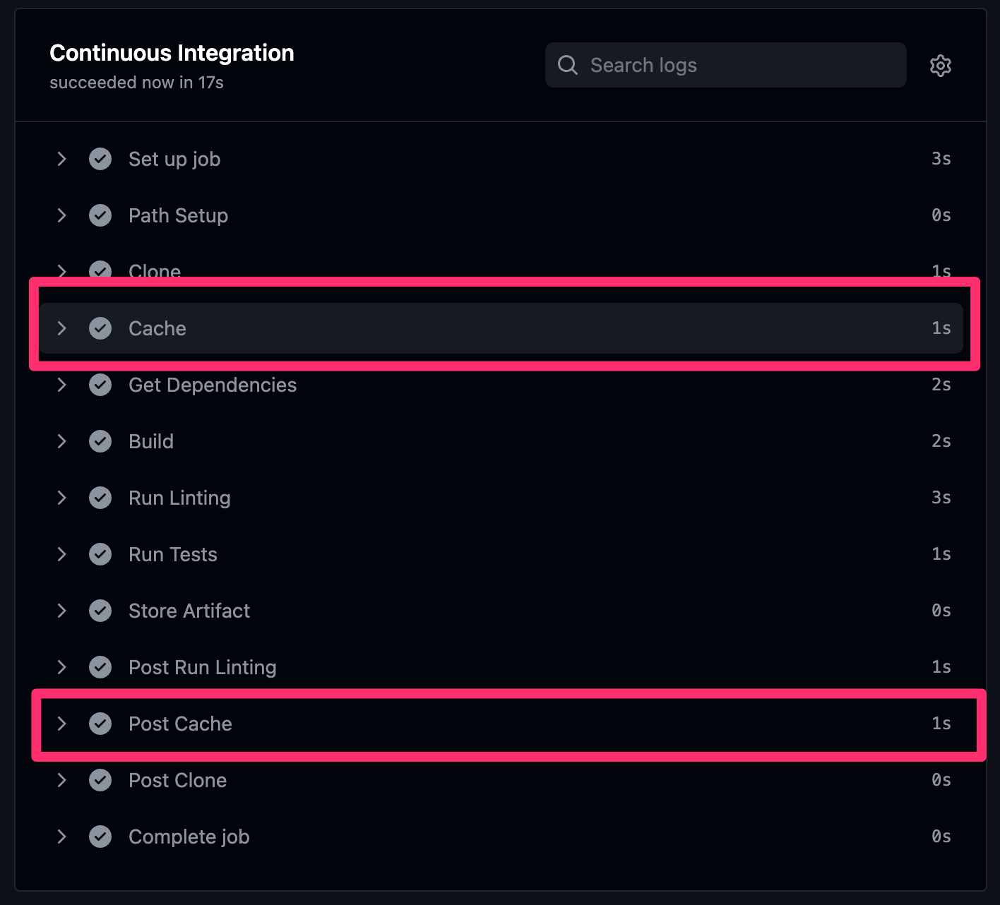

# Caching
When working with workflows, you might find yourself performing the same set of tasks multiple times across workflows or even jobs. This is commonly seen in build scenarios where dependencies are downloaded. Because Actions runners are ephemeral, the files from a previous execution are deleted.

This inevitably can cause builds to run longer, especially when the number of dependencies used are numerous.

In the previous exercise on `Continuous Integration`, you built a workflow that is performing automation when Pull Requests are opened to merge to the **default** branch. In this exercise, we will reuse that workflow to demonstrate a bit of caching.

## Prerequisite Exercises
- [13-Continuous-Integration](./13-Continuous-Integration.md)
- [14-Artifacts](./14-Artifacts.md)

---

## Step 1: Add the cache action
1. From the **default** branch of your repository, create a new branch of code called `feature/cache`
2. Open the file named `.github/workflows/ci-cd.yaml`
3. Replace the contents of the file with:

```yaml
name: Continuous Integration & Delivery
on:
  pull_request:
  workflow_dispatch:
defaults:
  run:
    shell: bash
jobs:
  ci:
    name: Continuous Integration
    runs-on: ubuntu-latest
    defaults:
      run:
        working-directory: golang_app
    steps:
      - name: Path Setup
        id: go-paths
        working-directory: ${{github.workspace}}
        run: |
          echo "::set-output name=gomodcache::$(go env GOMODCACHE)"
          echo "::set-output name=gocache::$(go env GOCACHE)"
      - name: Clone
        uses: actions/checkout@v3.1.0
      - name: Cache
        uses: actions/cache@v3.0.10
        with:
          path: |
            ${{ steps.go-paths.outputs.gomodcache }}
            ${{ steps.go-paths.outputs.gocache }}
          key: ${{ runner.os }}-gomodcache-${{ hashFiles('**/go.sum') }}
      - name: Get Dependencies
        run: go get app
      - name: Build
        run: go build
      - name: Run Linting
        uses: golangci/golangci-lint-action@v3
        with:
          working-directory: golang_app
      - name: Run Tests
        run: go test
      - name: Store Artifact
        uses: actions/upload-artifact@v3.1.0
        with:
          name: golang_app
          path: golang_app/app
```

4. Replace the contents of the file [golang_app/main.go](./golang_app/main.go) with the contents in [./golang_replacements/15-main.go](./golang_replacements/15-main.go)
5. Replace the contents of the file [golang_app/go.mod](./golang_app/go.mod) with the contents in [./golang_replacements/15-go.mod](./golang_replacements/15-go.mod)
6. Replace the contents of the file [golang_app/go.sum](./golang_app/go.sum) with the contents in [./golang_replacements/15-go.sum](./golang_replacements/15-go.sum)
7. Add & commit your changes, then publish your branch.
8. Go to your repository, and view the Pull Requests tab.
9. Create a pull request to merge `feature/cache` into your **default** branch.

In the steps above, you added several steps to the workflow file. These steps help to define the Go paths for caching, and then pass those paths to the `actions/cache` action that handles the downloading & updating of caches. You will now see two additional steps (`Cache` and `Post Cache`)



No additional step is required to save your cache, because the action has post-execution hooks that handle it for you.

The result won't be a lot of time saved because the number of dependencies are very few, but in a real-world scenario this could save a lot, reducing dependency downloads from the 10's of minutes to just a few seconds.

## Step 2: View The "Caches" Area On The Workflow
Within the workflow overview, the caches for any given workflow can be seen. You will need to have a successful execution first, but afterwards the view will be available.

1. Go to the `Actions` tab on your repository.
2. Click the `Continuous Integration & Delivery` workflow on the left.
3. Finally, click the `Caches` link from the left hand navigation. You can also do this from the top (no need to drill in to `Actions`) to see all caches across a repository.


## Step 3: Merge the changes to your default branch and update your local repository

1. Click the green `Merge pull request` button on the pull request from step 1.9. This will put your code into the main branch.
2. Delete the published branch.
3. Checkout to your default branch locally and pull down the changes.

---

## Additional Documentation
- [GitHub Actions Caching](https://github.com/actions/cache)